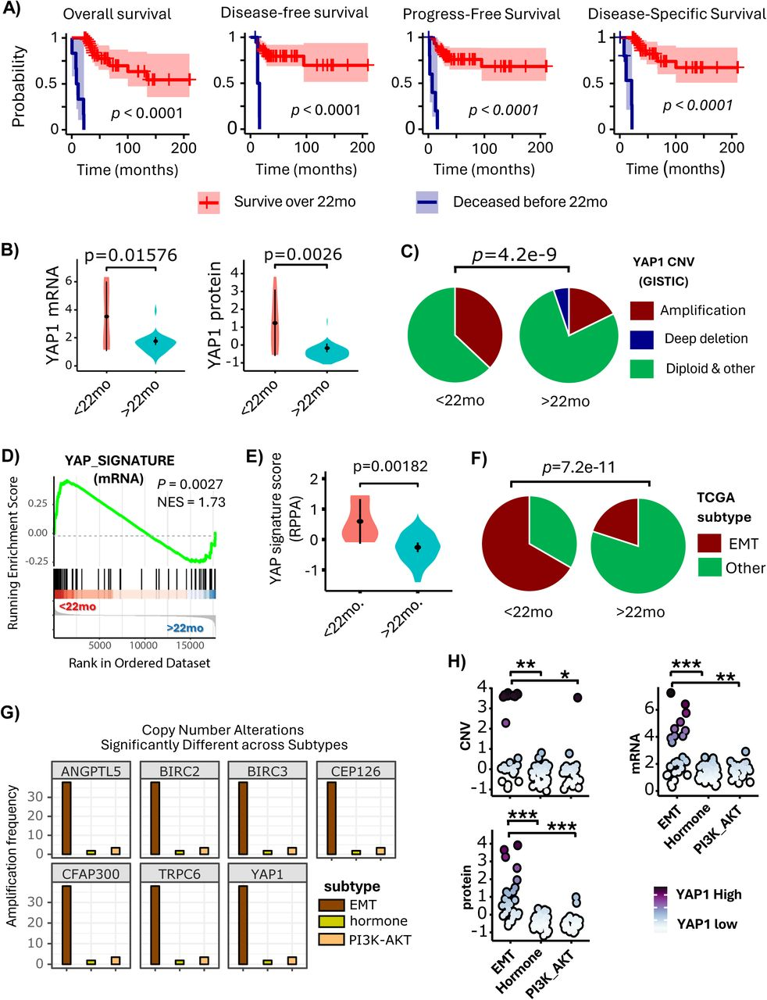
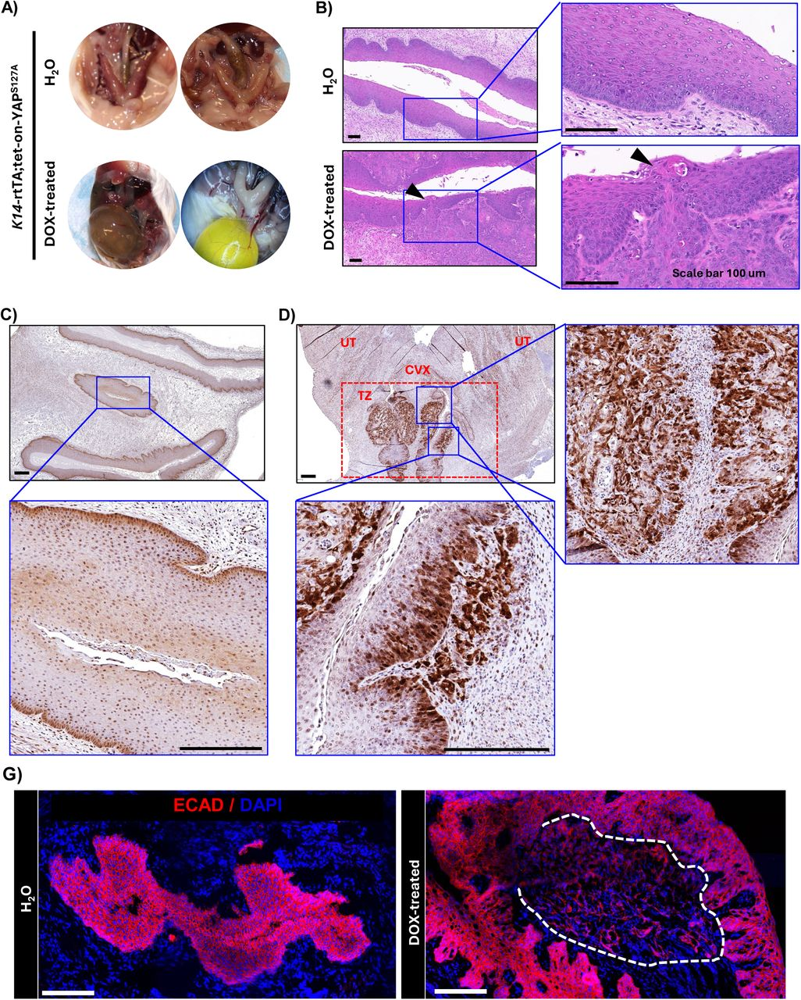
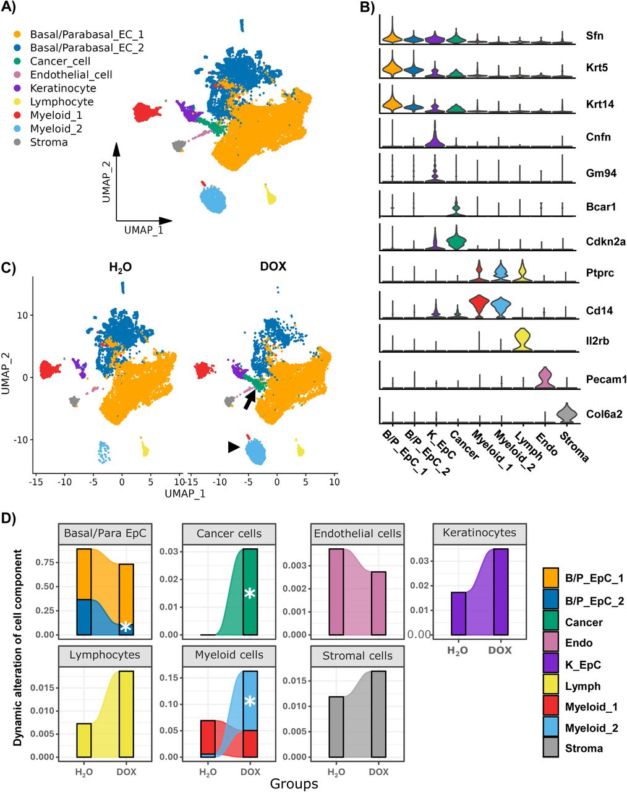
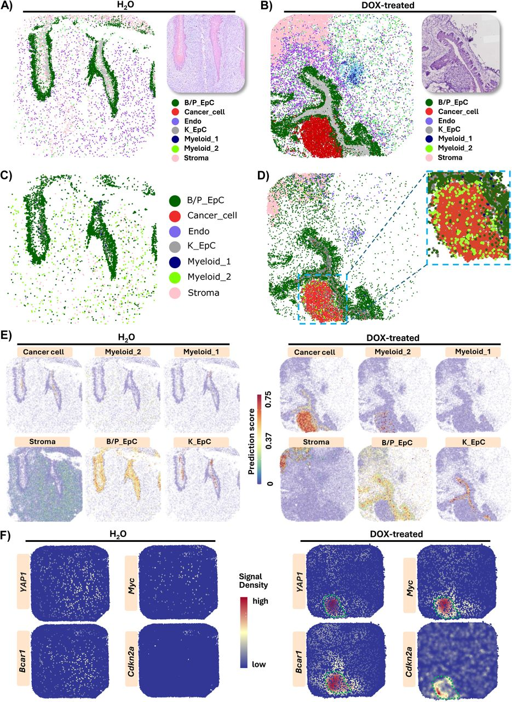
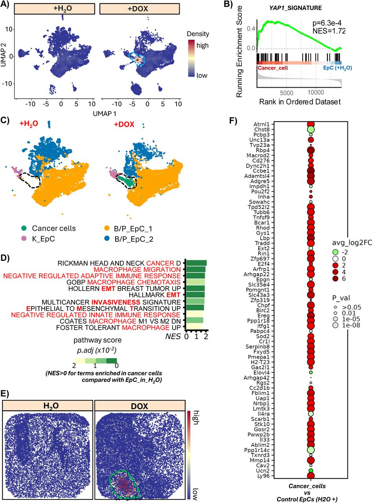
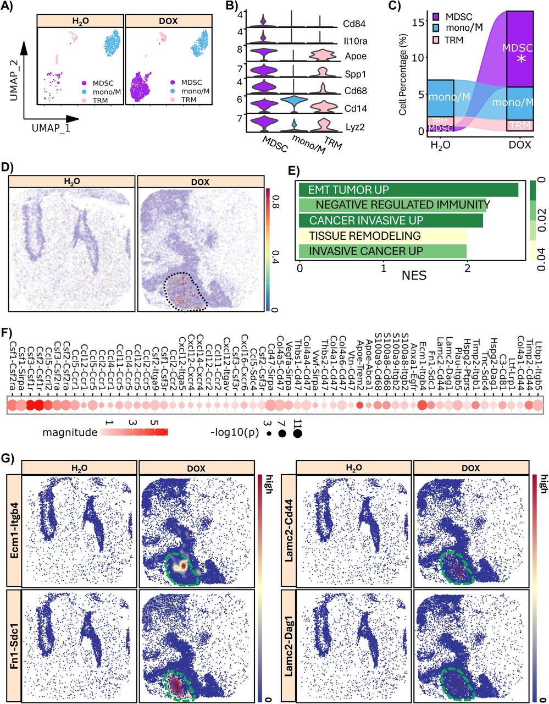
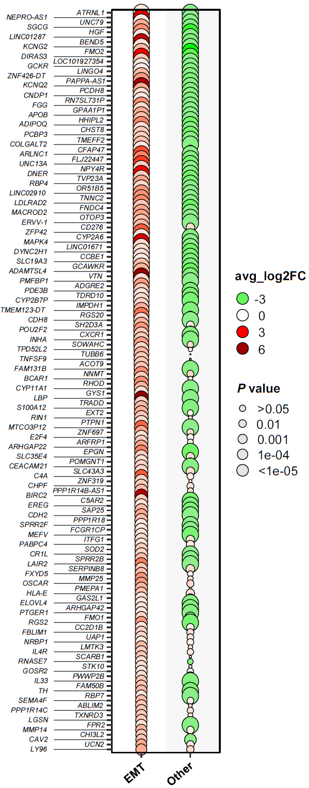

# Integrated Analysis of Spatial Genomics and scRNAseq Identifies Occult Cervical Cancer Subtypes: Why Current Billion Dollar Screening Programs Fail the Most At-Risk Patients

## Project Summary
Integrated analysis of spatial genomic, single-cell transcriptomic, genomic, and clinical data identified a deadly occult cervical cancer subtype. The subtype of cervican cancer can evade from the biollion dollar screening programs such as Pep smear and HPV screenings as it is HPV-independent and invades into stromal leaving cervical epithelial surface intact.

The analysis also drove prevention strategies that we have preclinically validated. Please see the [bioRxiv](https://doi.org/10.64898/2026.01.18.700207) for lastest updates. The scripts will be released here once published.

## Abstract
- Cervical cancer (CVC) is classically understood as an HPV-driven disease in which high-risk HPV infects cervical basal epithelial cells, induces neoplastic transformation, and drives upward epithelial expansion, which led to the billion dollar cytology- and HPV-based screening programs multiple contries are deploying.

- However, in the United States, where HPV testing and Pap smears have reached near-maximal implementation, the CVC mortality rate has plateaued for more than two decades. What if there is a subset of CVC that can escape current screening strategies?

- Integrated analysis of spatial genomic, single-cell transcriptomic, genomic, and clinical data identified a deadly occult cervical cancer subtype:
    - YAP1 hyperactivation is key contributor to this subtype as evidenced from DNA mutation, CNV, RNA and protein expression and pathway signatures.
    - Transgenic mouse models demonstrate that hyperactivation of YAP1 caused by disruption of Hippo-YAP signaling is sufficient to induce a subtype of HPV-independent invasive CVC that lacks surface lesions and therefore evades HPV- and cytology-based detection.
    - YAP1-driven tumors adopt an EMT-high transcriptional state and selectively recruit immunosuppressive myeloid-derived suppressor cells that functionally interact with cancer cells to promote invasion and progression.
    - Its cellular and molecular mechanisms, and immune microenvironment we defined drove preventive strategies.

## Clinical Significance
Despite an annual $10 billion global investment in cervical cancer (CVC) screening infrastructure, mortality rates in highly screened nations like the U.S. have remained stagnant for over 20 years. This study exposes the critical biological "blind spot": a YAP1-driven, HPV-independent and deadly subtype that fundamentally evades the cytology- and HPV-based screenings. Our discovery drives new diagnostics and therapeutics essential to capturing the invasive cases that current billion-dollar programs are biologically designed to miss.

## Results
### Figure 1: YAP1 is hyperactivated in a portion of cervical cancer patients that have poor prognosis.

  <a href="https://doi.org/10.64898/2026.01.18.700207" target="_blank">
     
        
       <em></em>
  </a>

> A) Overall survival (OS), Progress-free survival (PFS), Disease-specific survival (DSS) and Disease-Free survival (DFS) of cervical cancer patients who survived over 22 months (n=144) and those who deceased within 22 months (n=40). P values were derived from log rank test.  B) Expression of YAP1 mRNA and protein in cervical cancer patients who deceased within 22 months (<22 mo) and those who survived over 22 months (>22 mo). P values were from unpaired two-sided t test.  C) YAP1 copy number variation (CNV) in cervical cancer patients who deceased within 22 months (<22 mo) and those who survived over 22 months (>22 mo). Data is presented as GISTIC values. P values were from Pearson’s Chi-squared test.  D) Gene Set Enrichment Analysis (GSEA) plot showing enrichment of YAP1 signature genes in patients who deceased within 22 months (<22 mo) when compared to those who survived over 22 months (>22 mo). P values were derived from GSEA permutation based on an adaptive multi-level split Monte-Carlo scheme implemented in fgsea R package.  E) Relative protein levels (RPPA score) of YAP1 signature genes in cervical cancer patients who deceased within 22 months (<22 mo) and those who survived over 22 months (>22 mo). p values were from unpaired two-sided t test.  F) Frequency of cervical cancer subtypes (classified using TCGA cervical cancer subtyping strategies) in cervical cancer patients who deceased within 22 months (<22 mo) and those who survived over 22 months (>22 mo). P values were from Pearson’s Chi-squared test.  G) A comparison of amplification frequency of YAP1 and its downstream genes (ANGPTL5, BIRC2, BIRC3, CEP126, CFAP300, and TRPC6) across EMT, Hormones, and PI3K-AKT subtypes. q values are Benjamini-Hochberg adjusted p values derived from Chi-squared test. A q values < 0.05 was considered as significantly different when compared to each other.  H) A comparison of copy number variation (CNV), mRNA expression, and protein levels of YAP1 across EMT, Hormones, and PI3K-AKT subtypes. p values were from unpaired two-sided t test. A p values < 0.05 was considered as significantly different. * p<0.05, ** p<1e-3, *** p<1e-5, when compared to each other.
---

### Figure 2: Activation of YAP1 in cervical epithelial cells leads to tumors exhibiting high invasiveness and strong EMT signatures.

  <a href="https://doi.org/10.64898/2026.01.18.700207" target="_blank">
     
        
       <em></em>
  </a>

> A) Representative images showing the ureter obstruction in of Krt14-rtTA;Tet-on-YAPS127A mice induced by doxycycline (DOX-treated, lower panel). Krt14-rtTA;Tet-on-YAPS127A mice administered with water (H2O, upper panel) were used as control. Note the enlarged bladders caused by the ureteral obstruction due to tumorigenesis in DOX-treated Krt14-rtTA;Tet-on-YAPS127A mice induced (n = 5-8/group).  B) Representative images showing the histology (H&E staining) of cervical epithelium in the Krt14-rtTA;Tet-on-YAPS127A mice induced with doxycycline (DOX, lower panel) or water (H2O, upper panel). Arrowheads point to the invading site where transformed epithelial cells break the basal membrane and invade into the stromal layer of cervical tissues. Scale bar: 100 µm.  C) representative images showing the expression of YAP1 protein (in brown, detected by IHC) in cervical tissues of Krt14-rtTA;Tet-on-YAPS127A mice induced with water as control. Scale bar: 200 µm.  D) representative images showing the expression of YAP1 protein (in brown, detected by IHC) in cervical tissues of Krt14-rtTA;Tet-on-YAPS127A mice administered with doxycycline. Scale bar: or DOX (lower panel). A dash-lined red rectangle box was used to highlight the transformation zone (TZ) of mouse uterine cervix. Two blue-line squares in the transformation zone highlight the newly formed cancer tissues in the cervix of Dox-induced Krt14-rtTA;Tet-on-YAPS127A mice. UT: uterine tubes; CVX: cervix. Scale bar: 200 µm.  E) Representative images showing expression of E-cadherin (in red, detected by fluorescent immunohistochemistry) in the cervical tissue of Krt14-rtTA;Tet-on-YAPS127A mice administered with water (H2O, left) or doxycycline (Dox-treated, right). Carcinoma cells invaded into the stromal area, which express relatively low E-cadherin (CDH1+), were circled with a white dished-line. Scale bar: 100 µm.
---

### Figure 3: Single-cell RNA-seq reveals dynamic remodeling of the cervical cellular landscape during early tumorigenesis.

  <a href="https://doi.org/10.64898/2026.01.18.700207" target="_blank">
     
        
       <em></em>
  </a>

> A) UMAP plot showing overview of 9 major cell types identified in cervical tissues in Krt14-rtTA;Tet-on-YAPS127A mice administered with water (H2O) as control or doxycycline (DOX) for tumorigenesis.  B) Violin plots showing expression of marker genes for the identified cell clusters, including markers for Basal/Parabasal epithelial cell (EC) 1, Basal/Parabasal EC 2, Keratinocyte, Cancer cell, two myeloid cells (Myeloid_1 & Myeloid_2), Lymphocyte, Endothelial cell, and Stroma cells.  C) UMAP plots showing the alteration of cellular components in cervical tissues of Krt14-rtTA;Tet-on-YAPS127A mice administered with water (H2O) as control or doxycycline (DOX) for induction of tumorigenesis. Arrow points to the newly formed carcinoma cells, while the arrowhead points to the accumulated myeloid 2 cells (tumor-associated macrophages) during early-stage of tumorigenesis.  D) Bar plots overlaid with a smoothed area curve showing dynamic alterations of major cellular components of cervical tissues of Krt14-rtTA;Tet-on-YAPS127A mice during Doxycycline (DOX)-induced tumorigenesis. Krt14-rtTA;Tet-on-YAPS127A mice treated with water (H2O) were used as control. *: significantly different from the control (H2O). Statistical differences were calculated with scCODA with FDR = 0.05.
---

### Figure 4: Mapping cervix cellular and molecular reprogramming during mesenchymal transition and invasion using spatial transcriptomics.

  <a href="https://doi.org/10.64898/2026.01.18.700207" target="_blank">
     
        
       <em></em>
  </a>

> A & B) Spatial transcriptomic plot showing that unsupervised clustering based on spatial transcriptomics data successfully captured the morphology of cervical tissue in Krt14-rtTA;Tet-on-YAPS127A mice administered with water (H2O, panel A) and Doxycycline (DoX, panel B). The identified cell clusters are presented in different colors.  C & D) Spatial distribution of sc-RNAseq-identified cells in the cervical tissues of KY mice treated with water (H2O, panel C, as negative control) or doxycycline (DOX, panel D). The cells were identified using marker/reference genes derived from the SC-RNAseq analyses of the matched samples. The color codes used to annotate cells in panel C) and panel D) are same. The dash-border square highlights the area with the newly formed cancer cells. A zoom-in view was presented on the right to visualize cancer cells (red) and tumor-associated myeloid cells (bright green, myeloid_2) in the tumor region.  E) Spatial transcriptomic plots mapping the location of each individual cell type in cervical tissues in Krt14-rtTA;Tet-on-YAPS127A mice treated with water as control (H2O, left) or doxycycline (DOX, right) to induce tumorigenesis. Cells were annotated using cell markers/references identified using sc-RNAseq analyses of the matched samples. Color intensity encodes the prediction score, corresponding to the confidence level of the cell-type assignment.  F) Spatial transcriptomic plots mapping the expression and location of YAP1, Myc, Bcar1 and Cdkn2a genes in cervical tissues of Krt14-rtTA;Tet-on-YAPS127A mice treated with water as control (H2O, left) or doxycycline (DOX, right) to induce tumorigenesis. The dash-border circle highlights the cancer region. Sequential color scales represent relative expression levels of dedicated genes.
---

### Figure 5: A combination of Single-cell RNAseq with spatial transcriptomics uncover the molecular mechanisms underlying the invasiveness of YAP1-induced carcinoma cells.

  <a href="https://doi.org/10.64898/2026.01.18.700207" target="_blank">
     
        
       <em></em>
  </a>

> A) UMAP plot derived from scRNAseq data showing density of YAP1 expression in cervical cells of KY mice administered with water as control (H2O) or Dox to induce cervical cancer. The dash-border circle highlights the cluster of cancer cells, which have the highest YAP1 transgene.  B) GSEA plot derived from scRNAseq data showing enrichment of YAP1 signature in cancer cells in Krt14-rtTA;Tet-on-YAPS127A mice induced with doxycycline (DOX) compared with cervical epithelial cells in control mice (KY mice treated with H2O).  C) UMAP plot derived from scRNAseq data showing epithelial cell subtypes in cervical tissues in KY mice treated with water (H2O) as control or Dox to induce CVC. The dash-border circle highlights the cluster of cancer cells. B/P_EpC; basal/parabasal epithelial cells; K_EpCs: Keratinized cervical epithelial cells.  D) The pathways enriched in invasive cancer cells in Dox-induced KY mice when compared to cervical epithelial cells in control mice (KY mice treated with H2O as negative control). Color scales show adjusted P values.  E) Spatial transcriptomics plot showing density of EMT signature (77) subtypes in cervical tissues in control (H2O) and Dox-induced KY mice. The dash-border circle highlights the cluster of cancer cells. Sequential color scale represents the signal density of EMT signature genes. The dash-border circle highlights the cancer region.  F) A bubble chart showing the upregulation of EMT signature genes in invasive cancer cells. The relative gene expression data of EMT signature genes in invasive cancer cells and control cervical epithelial cells were derived from single-cell RNA sequencing analyses of single cells isolated from cervical tissues from doxycycline-induced KY mice and non-induced KY mice (H2O+, used as negative control). The color represented average log2 fold changes (avg_log2FC) in gene expression levels of invasive cancer cells relative to non-induced control cervical epithelial cells (control EpCs-H2O+). The size marks the p values generated by non-parametric Wilcoxon rank sum test implemented in R package Seurat. The analysis was restricted to human EMT signature ortholog genes (17). Notably, 95% of EMT signature genes are upregulated in invasive cancer cells compared to non-induced control cervical epithelial cells.
---

### Figure 6: A combination of Single-cell RNAseq with spatial transcriptomics reveals a role of MDSC in mesenchymal cervical cancer development.

  <a href="https://doi.org/10.64898/2026.01.18.700207" target="_blank">
     
        
       <em></em>
  </a>

> A) UMAP plot showing subtypes of myeloid cells in cervical tissue in Krt14-rtTA;Tet-on-YAPS127A mice administered with water as control (H2O) or doxycycline (Dox) to induce cervical cancer. MDSC: Myeloid-derived suppressor cells; Mono/M: other myeloid cells; TRM: Tissue resident macrophages.  B) Violin plots showing expression of representative marker genes of the identified the major myeloid subtypes in A).  C) Dynamic alterations of myeloid cell subtypes in cervical tissues in control (H2O) and doxycycline-induced (DOX) Krt14-rtTA;Tet-on-YAPS127A mice. *: significantly different when compared to control group. Statistical difference was performed with scCODA with FDR= 0.05.  D) Spatial transcriptomic plot showing the location of MDSCs (identified using matched scRNAseq samples as reference) subtypes in cervical tissues in control (H2O) and doxycycline-induced (DOX) Krt14-rtTA;Tet-on-YAPS127A mice. Sequential color scales represent the prediction score / confidence of cell type assignments. The dash-border circle highlights the cancer region.  E) The pathways enriched in MDSCs in the cervical tissues of Krt14-rtTA;Tet-on-YAPS127A mice induced with doxycycline (DOX) when compared with that of myeloid cells in cervical tissues of the control mice (Krt14-rtTA;Tet-on-YAPS127A mice administered with H2O). Color scales show adjusted P values.  F) The active ligand-receptor interactions between cancer cells and MDSCs. Magnitude is calculated as the arithmetic average of the mean expression of the ligand in the senders and the receptor in the receivers, using the minimum subunit expression for any multi-subunit complexes involved. P values were derived by random permutation of cell cluster labels implemented in Python package CellphoneDB. A p<1E-3 is considered specific. Please note that the primary interactions are associated with chemotaxis, immunosuppression, EMT and tumor invasiveness. G) Spatial distance and signal strength weighted density of ligand-receptor interactions between cancer cells and MDSCs in cervical tissues of control (H2O) and doxycycline-induced (DOX) Krt14-rtTA;Tet-on-YAPS127A mice. Please note that the primary interactions are associated with immunosuppressive, EMT and tumor invasive. Sequential color scales represent the signal density of a specific interaction between cancer cells and MDSCs in the indicated tissues.
---

### Figure S4: A bubble chart illustrating the human cervical cancer markers unique to EMT subtype.

  <a href="https://doi.org/10.64898/2026.01.18.700207" target="_blank">
     
        
       <em></em>
  </a>

> •	The relative expression of genes for human epithelial-to-mesenchymal transition (EMT) and other subtypes (a combination of PI3K-AKT and Hormone subtypes) in human samples (TCGA) is presented as the average log₂ fold change (avg_log₂FC) relative to that of the normal human cervix.  •	These genes are significantly higher expressed in human EMT subtype of cervical cancer compared with normal cervix. However, they are not highly expressed in other subtypes of cervical cancer compared with normal cervix.  •	EMT: EMT cancer Vs Normal control; Other: other cancer Vs Control.  •	Notably, 95% of the orthologs of these genes are upregulated in tumor cells derived from Dox induced KY mice compared with normal mouse cervix (KY-H2O) (Relevant to Fig. 5F)
---